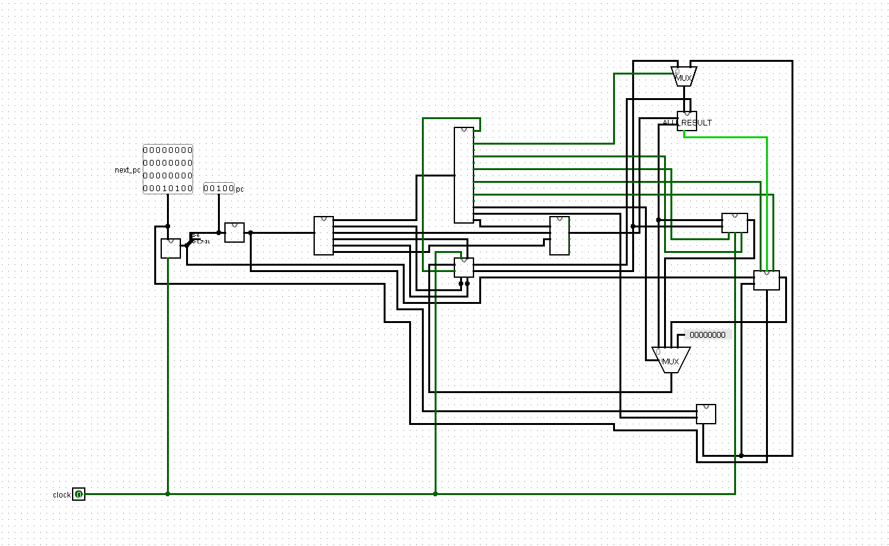

# 32-bit Single-Cycle RV32I CPU in Logisim

A 32-bit single-cycle CPU implementing a subset of the RISC-V RV32I instruction set. The processor was designed, integrated, and verified in Logisim.

## Architecture



The processor uses a single-cycle datapath: each instruction completes in one clock cycle.

Main components:

* 32-bit Program Counter
* Instruction Memory
* Instruction Splitter
* 32 × 32-bit Register File with `x0` hardwired to zero
* Immediate Generator for I, S, B, and J formats
* Main Control Unit
* ALU Control Unit
* 32-bit ALU
* Data Memory
* Branch and Jump Logic
* ALUSrc and ResultSrc multiplexers

## Supported Instructions

| Instruction | Type | Operation                           |
| ----------- | ---- | ----------------------------------- |
| `ADD`       | R    | `rd = rs1 + rs2`                    |
| `SUB`       | R    | `rd = rs1 - rs2`                    |
| `AND`       | R    | `rd = rs1 & rs2`                    |
| `OR`        | R    | `rd = rs1 \| rs2`                   |
| `ADDI`      | I    | `rd = rs1 + immediate`              |
| `LW`        | I    | Load a 32-bit word from memory      |
| `SW`        | S    | Store a 32-bit word in memory       |
| `BEQ`       | B    | Branch when two registers are equal |
| `JAL`       | J    | Jump and save `PC + 4` in `rd`      |

## Control Flow

During normal execution:

```text
next_pc = pc + 4
```

For a taken `BEQ` or a `JAL` instruction:

```text
next_pc = pc + immediate
```

The ALU `zero` signal is used to determine whether a `BEQ` branch is taken.

## Verification

Directed test programs were used to verify every supported instruction.

| Test          | Instructions                      | Result |
| ------------- | --------------------------------- | ------ |
| Arithmetic    | `ADD`, `SUB`, `ADDI`              | Passed |
| Bitwise logic | `AND`, `OR`                       | Passed |
| Memory access | `SW`, `LW`                        | Passed |
| Control flow  | `BEQ`, `JAL`                      | Passed |
| PC sequencing | `PC + 4`, branch and jump targets | Passed |

Example arithmetic test:

```assembly
ADDI x7, x0, 10
ADDI x9, x0, 20
ADD  x2, x7, x9
```

Expected and observed result:

```text
x7 = 10
x9 = 20
x2 = 30
```

The memory test stored and loaded the value `42` successfully using `SW` and `LW`.

## Running the Project

1. Download `rv32i_single_cycle_cpu.circ`.
2. Open it using Logisim 2.7.1.
3. Open the `CPU_Top` circuit.
4. Load or edit the test program in Instruction Memory.
5. Select `Simulate → Reset Simulation`.
6. Toggle the clock from `0 → 1 → 0` for each instruction.
7. Inspect the Program Counter, Register File, and Data Memory.

## Project Files

```text
rv32i_single_cycle_cpu.circ  - Complete Logisim processor
cpu_top.png                  - Top-level CPU datapath screenshot
README.md                    - Project documentation
```

## Current Limitations

* Implements only the listed RV32I instructions
* Single-cycle design without pipelining
* No cache, interrupts, or exception handling
* Instruction and data memories contain 32 words each
* Logisim implementation only; SystemVerilog RTL is planned as a future extension

## Author

Abed Alrahman Yosef
Electrical Engineering Student, Tel Aviv University

[LinkedIn](https://www.linkedin.com/in/abed-yosef-907527209)
